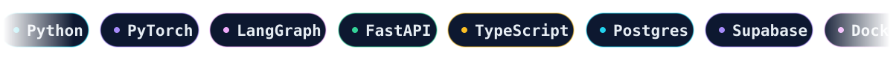

**Jegan Murali** · AI Systems Engineer. I build agentic AI, RAG and voice AI at **Ecom Ignite**, and take on select contract builds.

 

## What I build

<table>
<tr>
<td width="120" align="center" valign="top"></td>
<td valign="top">

### Agentic systems
AI that takes real actions, with **scoped tools, approval paths, evals and monitoring**, so it does the job without surprising you. 
<b>Good fit if</b> a workflow still needs a person clicking through tools.

</td>
</tr>
<tr>
<td width="120" align="center" valign="top"></td>
<td valign="top">

### Data intelligence
**RAG and business-data products** that return controlled, explainable answers from your own data, not confident guesses. 
<b>Good fit if</b> your team keeps asking the same questions of messy spreadsheets, databases or documents.

</td>
</tr>
<tr>
<td width="120" align="center" valign="top"></td>
<td valign="top">

### Voice AI
**Speech-to-speech experiences** for education, accessibility and customer operations that feel natural to talk to. 
<b>Good fit if</b> typing is the barrier between your users and your product.

</td>
</tr>
</table>

## Proof, not promises

<table>
<tr>
<td width="50%" valign="top">

Ask company data anything in plain language. Read-only tools, **SQL validation** and human approval keep answers safe, and **Mira Monitor** tracks latency, errors and cost.

</td>
<td width="50%" valign="top">

Runs real commands on your machine, so it ships with real guardrails: a blocklist, confirmation before anything disruptive, tests and CI. **Groq or fully local with Ollama.** [View the code →](https://github.com/JeganMurali/linux-ai-agent)

</td>
</tr>
<tr>
<td width="50%" valign="top">

A speech-to-speech learning assistant for blind children, built on Whisper, LLaMA 70B and fine-tuned TTS.

</td>
<td width="50%" valign="top">

CNN + DNABERT-2 (LoRA) + KAN for CRISPR-Cas9 off-target prediction in cystic fibrosis, with an LLM safety-audit summary. [Read more →](https://github.com/JeganMurali/Neuro-CRISPR-KAN)

</td>
</tr>
</table>

Also built: [AURA](https://github.com/JeganMurali/AURA-), an AI companion that guides people through emotions, mindfulness and inner-child work before therapy begins.

## How an engagement works

**1. Intro** → You describe the problem. I say honestly if AI is the right tool for it.

**2. Thin slice** → One real task, end to end, fast. You see it work before we commit to more.

**3. Build &amp; prove** → Guardrails, evals and tests go in before the system grows.

**4. Ship &amp; watch** → Release with monitoring, then improve from what it actually does.

## Under the hood

<b>Systems:</b> agent design · tool orchestration · guardrails · evaluation · observability · RAG 
<b>Models:</b> LLaMA · Hugging Face · Whisper · LoRA · TTS · DNABERT-2 · KAN

## My contribution city

Every commit raises a skyscraper. <a href="https://gitcity.natrajx.in/?username=JeganMurali">Drive through the live 3D version</a>

Reliable AI is not just a model. It is the whole system around it.

